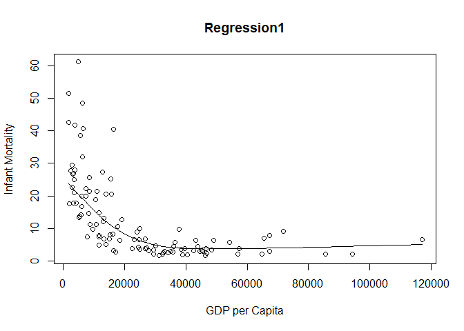
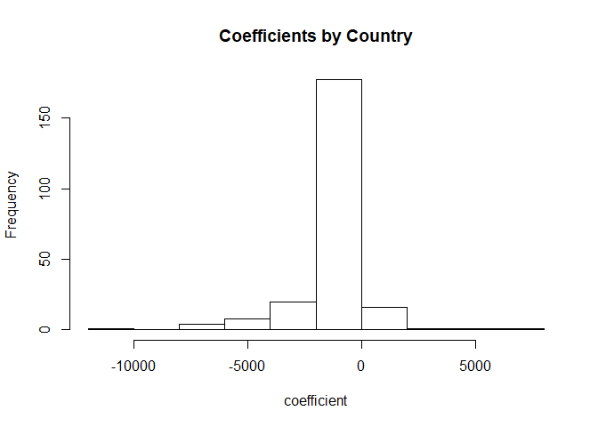

# Homework 4 - Functions II

## 1. Functions in the R Base Package

#### 1a. Longest Name: Use the appropriate `map` function to produce a vector of the names of all functions in the base R package. Which function has the longest name?


```r
content <- mget(ls("package:base"), inherits = TRUE)
base_functions <- Filter(is.function, content)


base_functions1 <- names(base_functions)
base_functions1 <- list(base_functions1)
longest_name <- map(base_functions1, function(x) nchar(x))
```


```r
test <- do.call(rbind, Map(data.frame, A=base_functions1, B=longest_name))

df <- data.frame(test)

long <- df %>%
  select(A,B) %>% 
  top_n(1)
```

```
## Selecting by B
```

```r
long
```

```
##                                    A  B
## 1 getDLLRegisteredRoutines.character 34
```

The longest function name is "getDLLRegisteredRoutines.character" with a length of 34 characters.

#### 1b. Number of arguments: Use the appropriate `map` function to calculate the number of arguments by function. Present a table of the Top 10 functions with the most arguments. Which base function has the most arguments? Hint: Remember that the functions `formals()`, `body()`, and `environment()` allow you to access parts of a function.

"scan" is the base function with the most arguments. It contains a total of 22.

```r
library(data.table)
```

```
## 
## Attaching package: 'data.table'
```

```
## The following objects are masked from 'package:dplyr':
## 
##     between, first, last
```

```
## The following object is masked from 'package:purrr':
## 
##     transpose
```

```r
numb_args <- map(base_functions, function(x) length(formals(x)))
df <- data.frame(numb_args)


top_args <- df %>% 
  gather(df$value) %>% 
  arrange(desc(value)) %>% 
  top_n(10)
```

```
## Selecting by value
```

```r
top_args
```

```
##            df$value value
## 1              scan    22
## 2    format.default    16
## 3            source    16
## 4           formatC    14
## 5  merge.data.frame    13
## 6         prettyNum    12
## 7           system2    11
## 8              save    10
## 9            system    10
## 10          library     9
## 11    print.default     9
## 12    withAutoprint     9
```

```r
top_args <- as.data.table(top_args)

top_args
```

```
##             df$value value
##  1:             scan    22
##  2:   format.default    16
##  3:           source    16
##  4:          formatC    14
##  5: merge.data.frame    13
##  6:        prettyNum    12
##  7:          system2    11
##  8:             save    10
##  9:           system    10
## 10:          library     9
## 11:    print.default     9
## 12:    withAutoprint     9
```


#### 1c. No Arguments: How many base functions have no arguments? What do you think is different about them? Note: The answer may differ a bit by machine depending on your R installation. No worries about that.


```r
no_args <- map(base_functions, function(x) is.null(formals(x)) & length(formals(x)) == 0)

no_args_df <- no_args %>% 
  data.frame() %>% 
  gather() %>% 
  select(value) %>% 
  filter(value=='TRUE') %>% 
  count()

no_args_df
```

```
##   value freq
## 1  TRUE  224
```
224 functions do not have any formal arguments. From the looks of it, the functions without formal arguments provide descriptive statistics or descriptive information about a variable or function, like 'missing' or 'nargs'.


########################################################################################


#### 2a) Highest and lowest infant mortality rates in 2017

Importing WDI library

```r
library('WDI')
```

```
## Loading required package: RJSONIO
```

# Importing variables 

```r
WDI_data <- WDI(country = "all", indicator = c("NY.GDP.PCAP.PP.KD", "SP.DYN.IMRT.IN"), start = 1960, end = 2017, extra = TRUE, cache = NULL)
```


#### 2a. Highest and lowest infant mortality rates in 2017

```r
library(data.table)

colnames(WDI_data)[4] <- "gdpcap1"

colnames(WDI_data)[5] <- "infmort1"


top_five_infmort <- WDI_data %>%
  filter(year == "2017") %>% 
  group_by(country) %>%
  na.omit() %>% 
  select(country, gdpcap1,infmort1)  %>%
  arrange(desc(infmort1)) %>%
  head(5) %>% 
  as.data.table()

bottom_five_infmort <-  WDI_data %>%
  filter(year == "2017") %>% 
  group_by(country) %>%
  na.omit() %>% 
  select(country, gdpcap1,infmort1)  %>%
  arrange(infmort1) %>%
  head(5) %>% 
  as.data.table()


top_five_infmort
```

```
##                     country   gdpcap1 infmort1
## 1: Central African Republic  661.2400     87.6
## 2:             Sierra Leone 1390.3003     81.7
## 3:                     Chad 1768.1534     73.4
## 4:         Congo, Dem. Rep.  808.1332     70.0
## 5:                  Lesotho 2851.1528     66.5
```

```r
bottom_five_infmort
```

```
##       country  gdpcap1 infmort1
## 1:    Iceland 46482.96      1.6
## 2:   Slovenia 31400.84      1.7
## 3:    Finland 40585.72      1.9
## 4:      Japan 39002.22      1.9
## 5: San Marino 56861.47      2.0
```


#### 2b. Overall regression
Run an overall regression predicting infant mortality from GDP per capita. What do you find? Make a scatter plot (including a regression fit line).


```r
WDI_data_cleaned <- WDI_data %>% 
   filter(region == "Europe & Central Asia" | region == "Middle East & North Africa" | region == "South Asia" | region == "Latin America & Caribbean" | region == "Sub-Saharan Africa"| region == "East Asia & Pacific" | region == "North America") %>% 
  filter(year == "2017") %>% 
  select(country, gdpcap1, infmort1)


linearMod <- lm(infmort1 ~ gdpcap1, data=WDI_data_cleaned)
print(linearMod)
```

```
## 
## Call:
## lm(formula = infmort1 ~ gdpcap1, data = WDI_data_cleaned)
## 
## Coefficients:
## (Intercept)      gdpcap1  
##  21.0908362   -0.0003272
```

```r
scatter.smooth(x=WDI_data_cleaned$gdpcap1, y=WDI_data_cleaned$infmort1, xlab= "GDP per Capita", ylab="Infant Mortality", main="Regression1")
```

<!-- -->


#### 2c. Regression by region
Let's see if the overall relationship holds within world regions. Split the the data by region and create a nested list that contains these split data frames. In a single pipeline, re-estimate the regression for each of these data frames, obtain the coefficient estimates for the slope for each region and present them in a table (sorted by size of the coefficient).

```r
WDI_Data_df <- data.frame(WDI_data)
names(WDI_Data_df)[names(WDI_Data_df) == 'NY.GDP.PCAP.PP.KD'] <- 'gdpcap1'
names(WDI_Data_df)[names(WDI_Data_df) == 'SP.DYN.IMRT.IN'] <- 'infmort1'


WDI_data_region <- WDI_Data_df %>%
  split(WDI_Data_df$region) %>% 
  map(~ lm(gdpcap1 ~ infmort1, data = .)) %>% 
  map(~ coef(.)) %>% 
  map(2) %>% 
  bind_rows() %>% 
  t() %>% 
  data.frame() %>% 
  setDT(keep.rownames=TRUE)
  colnames(WDI_data_region)[1] <- "region" 
  colnames(WDI_data_region)[2] <- "coefficients"

WDI_data_region
```

```
##                        region coefficients
## 1:                 Aggregates   -295.34395
## 2:        East Asia & Pacific   -499.32790
## 3:      Europe & Central Asia   -632.23552
## 4: Latin America & Caribbean    -251.34427
## 5: Middle East & North Africa   -958.25623
## 6:              North America   -248.00486
## 7:                 South Asia    -82.57609
## 8:        Sub-Saharan Africa     -70.75885
```


#### 2d. Regression by country
Let's also check if the relationship is consistent if estimated within countries. Split the overall data by country and create a nested list that contains these split data frames.

Again, estimate a simple linear regression, predicting infant mortality by GDP per capita. In what percentage of the within-country regressions do we find a positive relationship (at the 95% confidence level) between GDP per capita and infant mortality? Make a histogram of the slope coefficients to illustrate the variation of the estimated relationship. Which country cases are most at odds with the overall regression estimated in part (b)?

Note: For some countries, there is probably insufficient or no data to estimate the model. I suggest using one of the functions dealing with error (safely / possibly) to make sure you obtain the results for the other country regressions. Alternatively, you can remove countries with insufficient data before the regressions.


```r
WDI_Data_df <- data.frame(WDI_data)
names(WDI_Data_df)[names(WDI_Data_df) == 'NY.GDP.PCAP.PP.KD'] <- 'gdpcap1'
names(WDI_Data_df)[names(WDI_Data_df) == 'SP.DYN.IMRT.IN'] <- 'infmort1'
```


```r
WDI_Data_df <- na.omit(WDI_Data_df)


WDI_data_country <- WDI_Data_df %>%
  split(WDI_Data_df$country) %>% 
  map(~ lm(gdpcap1 ~ infmort1, data = .)) %>% 
  map(~ coef(.)) %>% 
  map(2) %>% 
  bind_rows() %>% 
  t() %>% 
  data.frame() %>% 
  setDT(keep.rownames=TRUE)
  colnames(WDI_data_country)[1] <- "country" 
  colnames(WDI_data_country)[2] <- "coefficients"


WDI_data_country
```

```
##                  country coefficients
##   1:         Afghanistan    -27.63291
##   2:             Albania   -309.38632
##   3:             Algeria   -228.48845
##   4:              Angola    -50.18879
##   5: Antigua and Barbuda   -275.58354
##  ---                                 
## 226:  West Bank and Gaza   -123.21724
## 227:               World   -181.65511
## 228:         Yemen, Rep.     -3.41880
## 229:              Zambia    -21.64636
## 230:            Zimbabwe     10.57673
```


```r
num_coeff <- as.numeric(WDI_data_country$coeff)
num_coeff2 <- as.list(num_coeff)

count1 <- length(which(num_coeff > 0)) 
count1
```

```
## [1] 19
```

```r
count2 <- length(which(num_coeff < 0))

count2
```

```
## [1] 210
```

```r
Percent1 <-19/229*100
Percent1
```

```
## [1] 8.296943
```

```r
Percent2 <-210/229*100
Percent2
```

```
## [1] 91.70306
```


```r
library(dplyr)
rankedcountries <- WDI_data_country %>%
  arrange(desc(WDI_data_country$coefficients)) %>% 
  top_n(19)
```

```
## Selecting by coefficients
```

```r
rankedcountries
```

```
##                     country coefficients
## 1      United Arab Emirates 6999.6556272
## 2         Brunei Darussalam 5349.4059022
## 3                San Marino 3708.2977091
## 4                    Kuwait 1653.3518523
## 5               South Sudan  450.8443432
## 6                     Libya  326.3643472
## 7                     Gabon  173.1950394
## 8                  Dominica  148.9102167
## 9              Bahamas, The   59.7417620
## 10                 Zimbabwe   10.5767267
## 11 Central African Republic    6.7478286
## 12         Congo, Dem. Rep.    3.9211963
## 13                  Comoros    3.0426517
## 14                  Burundi    2.9808686
## 15            Guinea-Bissau    2.5367238
## 16                 Kiribati    2.3431929
## 17                    Haiti    2.2464925
## 18               Madagascar    1.5307929
## 19          Solomon Islands    0.7849299
```

```r
at_odds <- WDI_data_country %>%
  arrange(WDI_data_country$coefficients) %>% 
  top_n(1)
```

```
## Selecting by coefficients
```

```r
at_odds
```

```
##                country coefficients
## 1 United Arab Emirates     6999.656
```

```r
hist(num_coeff, xlab="coefficient", main = "Coefficients by Country")
```

<!-- -->
The UAE is the most at odds with our overall regression estimated in part b!

#### 2e. Added squared term

Let's see if we can improve the models slightly. Using the list of country data frames from (d), estimate regressions of infant mortality on GDP per capita and the square of GDP per capita. Compare the adjusted R-Squareds of the models with and without the added squared term of GDP per capita. Provide the average model adjusted R-squared with and without the squared term. Would you recommend to keep the squared term or not?


```r
library(broom)
x2<- poly(WDI_Data_df$gdpcap1, degree = 2, raw = TRUE)

WDI_data_squared <- WDI_Data_df %>% 
  split(WDI_Data_df$country) %>% 
  map(~ lm((infmort1)~(x2), data= WDI_Data_df)) %>% 
  map(tidy) %>%
  map(unlist) %>% 
  bind_rows() %>% 
  transpose %>%
  as.data.frame() %>% 
  setDT(keep.rownames=TRUE)

WDI_data_squared
```


```r
x1<- poly(WDI_Data_df$gdpcap1)

WDI_data_single <- WDI_Data_df %>% 
  split(WDI_Data_df$country) %>% 
  map(~ lm((infmort1)~(x1), data= WDI_Data_df)) %>% 
  map(tidy) %>%
  map(unlist) %>% 
  bind_rows() %>% 
  transpose %>%
  as.data.frame() %>% 
  setDT(keep.rownames=TRUE)

WDI_data_single
```


The average model according to the poly linear model above is 61.889. Meanwhile, the average model of the single linear model is 35.39. From my reading, it's best to use adjusted R-squared models when more variables are present. As these are dummy variables, it'd probably be better to use the regular R-squared.


